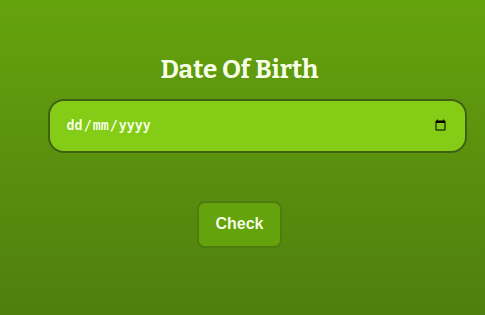
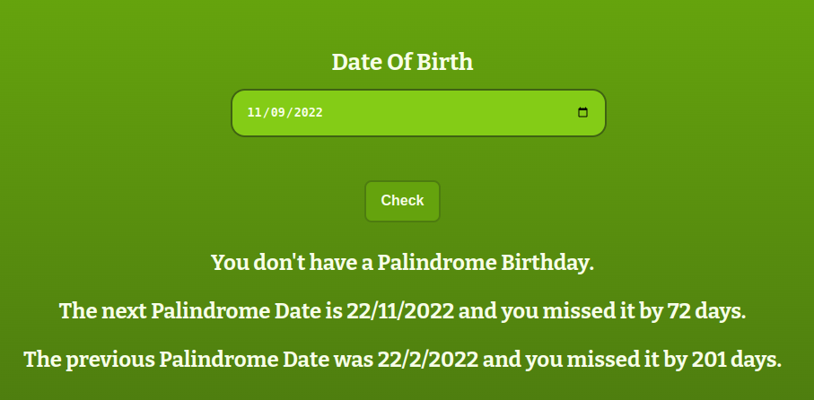

# Palindrome-Birthdays

## Made Using HTML, CSS and JavaScript

Do you know what a **Palindrome** is? It's something that remains same even when you read it backwards!

The Palindrome Birthdays app can check whether your birthday, or any date, is a plaindrome or not! All you have to do is set your **birthdate** (dd/mm/yy) **in its respective field** and click on **check**.

- **Interface**

The output will get displayed under the check button. Any errors will get displayed there as well.

- **Working**

***
#### Have Fun Searching For Palindromes!
